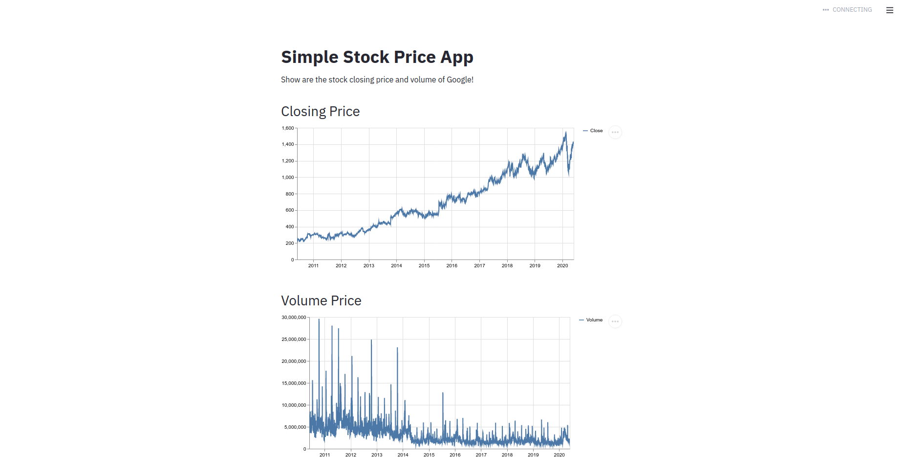

# Machine_Learning_Engineer
[](https://www.linkedin.com/in/edinorjr) [](https://www.python.org/downloads/release/python-365/) [](http://perso.crans.org/besson/LICENSE.html) [](https://github.com/zorrex82/Machine_Learning_Engineer)

<p align="center">
  
</p>

# Simple Stock Price
<sub>*Machine Learning Engineer</sub>

This is a simple application of streamlit to build a stock price, the objective with that sample is make a foundation to create a real project.
If you can, please contribute and share your knowledge.

**Screenshot from the project running**

<p align="center">
  
</p>


**How to proceed to running this app**

First install the dependencies

``` python

pip install -r requirements.txt

```
Then run the project with the command bellow

```python

streamlit run myapp.py

```

**Links:**
* [LinkedIn](https://www.linkedin.com/in/edinorjr)
* [Streamlit](https://www.streamlit.io/)
---


